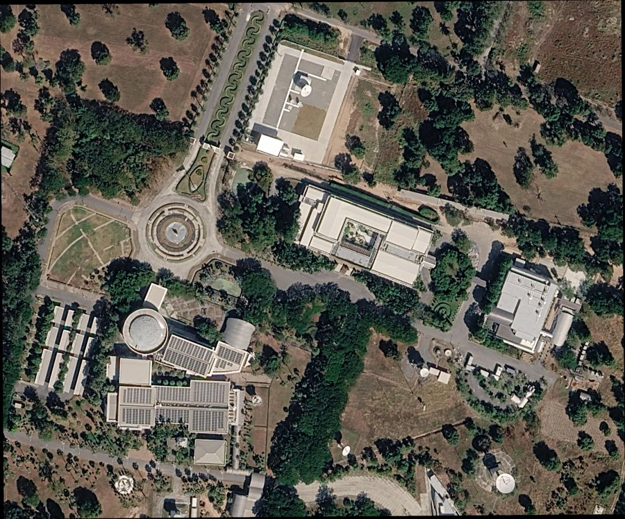
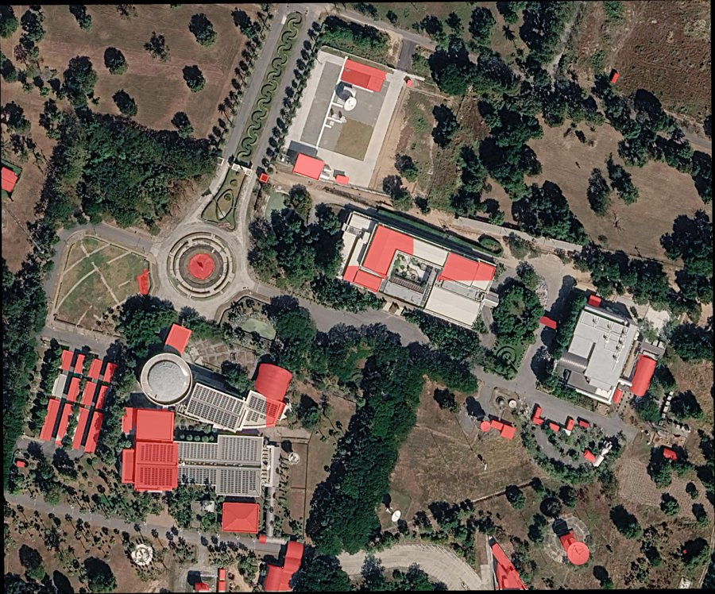
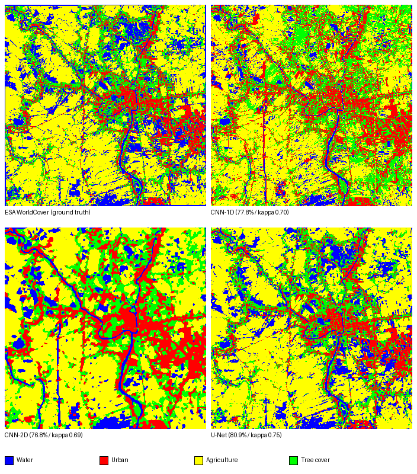

<div align="center">

# Deep Learning

**การเรียนรู้เชิงลึกสำหรับข้อมูลสำรวจโลก**
*(Deep Learning for Earth Observation)*

Created and modified by Thanit Nukoolrat and Claude


</div>

---

## ภาพรวม

การใช้ Deep Learning สำหรับงานสำรวจระยะไกล โดยทำตั้งแต่การเตรียมภาพถ่ายดาวเทียม
ที่มีความละเอียดสูงมาก การเทรนโมเดล CNN / U-Net สำหรับการจำแนกข้อมูลเชิงพื้นที่
ไปจนถึงการทดลองใช้ Pre-Trained Models (SAM, YOLO, GeoSAM) เพื่อสกัดวัตถุออกจากภาพ

## โครงสร้างโปรเจกต์

```
DeepLearning/
├── GoogleMap-Download.py   # ดาวน์โหลด + ใส่พิกัดให้ภาพถ่ายดาวเทียมจาก Google Maps
├── YOLO-Extraction.py      # สกัดอาคารออกจากภาพด้วยโมเดล YOLOv8 segmentation
├── S2OSM-CNN.py            # เทรน CNN-1D จำแนก LULC จาก Sentinel-2 (เทียบกับ RF)
├── S2OSM-CNN2D.py          # เทรน CNN-2D (patch 9x9) จำแนก LULC
├── S2OSM-UNet.py           # เทรน U-Net (dense supervision) จำแนก LULC
├── cnnandunet.html         # รายงานเปรียบเทียบ CNN-1D / CNN-2D / U-Net
├── requirements.txt        # ไลบรารีหลัก (.venv)
├── requirements-cnn.txt    # ไลบรารีสำหรับงาน CNN/TensorFlow (.venv-cnn แยกต่างหาก)
├── .vscode/settings.json   # ตั้งค่า Interpreter และ environment
└── .gitignore
```

## เริ่มต้นใช้งาน

**สิ่งที่ต้องมี:** Python 3.13, virtual environment และ (สำหรับขั้นตอนสร้าง
external overview pyramid) เครื่องต้องลง QGIS ไว้ด้วย

```bash
git clone https://github.com/porthanit/DeepLearning.git
cd DeepLearning

python -m venv .venv
.venv\Scripts\activate        # Windows

pip install -r requirements.txt
```

## วิธีใช้งาน

### ดาวน์โหลดภาพถ่ายดาวเทียมตามพื้นที่ที่สนใจ (AOI)

1. วาดสี่เหลี่ยมใน **Google Earth Engine → Geometry Tools** แล้วคัดลอกโค้ด
   `ee.Geometry.Polygon(...)` ที่ได้
2. นำพิกัด `[lon, lat]` ไปวางแทนที่ตัวแปร `AOI_LONLAT` ที่ด้านบนของไฟล์
   [`GoogleMap-Download.py`](./GoogleMap-Download.py)
3. รันสคริปต์:

   ```bash
   python GoogleMap-Download.py
   ```

**ผลลัพธ์ที่ได้:**

| ไฟล์ | รายละเอียด |
|---|---|
| `GoogleMap-Images.tif` | ภาพโมเสกที่ต่อแล้ว reproject เป็น `EPSG:32647` (UTM โซน 47N) |
| `GoogleMap-Images.tif.ovr` | External overview pyramid (2x / 4x / 8x / 16x) ช่วยให้เปิดดูใน QGIS ได้เร็วขึ้น |

ปรับค่า `ZOOM` ในสคริปต์เพื่อแลกระหว่างความละเอียดกับขนาดไฟล์ที่ดาวน์โหลด
(zoom 20 ≈ ความละเอียด 0.15 เมตร/พิกเซล เหมาะกับงานสกัดอาคาร)



### สกัดอาคารออกจากภาพด้วย YOLO

รันหลังจากได้ไฟล์ `GoogleMap-Images.tif` แล้ว:

```bash
python YOLO-Extraction.py
```

สคริปต์จะตัดภาพเป็น tile ขนาด 640x640 (มี overlap กันอาคารถูกตัดขอบ) แล้วรัน
โมเดล [`keremberke/yolov8m-building-segmentation`](https://huggingface.co/keremberke/yolov8m-building-segmentation)
(~55 MB ดาวน์โหลดอัตโนมัติจาก Hugging Face Hub ในการรันครั้งแรก) บน CPU

**ผลลัพธ์ที่ได้:**

| ไฟล์ | รายละเอียด |
|---|---|
| `YOLO-Extraction.tif` | Binary mask ของอาคาร กริด/CRS เดียวกับภาพต้นฉบับ |
| `YOLO-Extraction.geojson` | ขอบเขตอาคารเป็น polygon (CRS เดียวกับภาพต้นฉบับ) |



### เทรน CNN จำแนกข้อมูลเชิงพื้นที่ (เทียบกับ Random Forest)

โมเดล TensorFlow ลงในโฟลเดอร์ `.venv` เดิมไม่สำเร็จ จึงต้องแยก venv ใหม่:

```bash
python -m venv .venv-cnn
.venv-cnn\Scripts\activate
pip install -r requirements-cnn.txt
```

`S2OSM-CNN.py` ทำงานเหมือนโค้ด GEE JavaScript ฝั่ง Random Forest ทุกขั้นตอน
(AOI, composite Sentinel-2 + spectral indices, สุ่ม sample จาก ESA WorldCover,
แบ่ง train/test 70/30 ด้วย seed เดียวกัน) เพียงแต่เปลี่ยนตัวจำแนกจาก
`ee.Classifier.smileRandomForest` เป็น CNN-1D (Keras) เพื่อเปรียบเทียบผลลัพธ์
บนจุด sample ชุดเดียวกัน

ก่อนรัน ต้องแก้ `EE_PROJECT` ในไฟล์ให้เป็น GCP project id ของตัวเองที่เปิดใช้
Earth Engine API แล้ว และรัน `earthengine authenticate` (หรือปล่อยให้สคริปต์
เปิดเบราว์เซอร์ให้ login เองในการรันครั้งแรก)

```bash
python S2OSM-CNN.py
```

**ผลลัพธ์ที่ได้:**

| ไฟล์ | รายละเอียด |
|---|---|
| `S2OSM-CNN.keras` | โมเดล CNN-1D ที่เทรนแล้ว |
| `S2OSM-Composite.tif` | Sentinel-2 composite ทั้ง AOI ที่ดาวน์โหลดมาจาก Earth Engine |
| `S2OSM-CNN-Classified.tif` | แผนที่ LULC ที่จำแนกด้วย CNN (1=น้ำ, 2=เมือง, 3=เกษตร, 4=ไม้ยืนต้น) |

ผลทดสอบจริงบน AOI 20 กม. (100.45–100.65E, 14.25–14.45N): **accuracy 77.8%,
kappa 0.70** บนจุดทดสอบ 580 จุด แผนที่ที่ได้เห็นแม่น้ำ/เขตเมือง/นาข้าวแยกออก
จากกันชัดเจน (สมเหตุสมผลเชิงพื้นที่ ไม่ใช่แค่แม่นบนจุด sample)

**หมายเหตุสำคัญ (แก้ปัญหาที่เจอระหว่างพัฒนา):** สถาปัตยกรรมแรกที่ใส่
`BatchNormalization` ไว้ 2 ชั้น ทำให้ val accuracy ค้างที่ ~23% (แย่กว่าสุ่ม
เดา) เพราะข้อมูล train มีแค่ ~1,400 จุด การเทรนไม่กี่ epoch ไม่พอให้
running mean/variance ของ BatchNorm ลู่เข้า ทำให้ค่าที่ใช้ตอน inference
ไม่ตรงกับตอน train แก้โดยตัด BatchNorm ออก เปลี่ยนจาก min-max เป็น
z-score standardization และ monitor `val_accuracy` แทน `val_loss` ตอน
early stopping — เป็นบทเรียนที่ดีว่าทำไม RF ถึงมักจะ robust กว่า CNN
บนข้อมูลตารางขนาดเล็กแบบนี้

### เทรน CNN-2D และ U-Net แล้วเทียบผลกับ CNN-1D

ใช้ `.venv-cnn` เดียวกับ CNN-1D (ไม่ต้องติดตั้งอะไรเพิ่ม):

```bash
python S2OSM-CNN2D.py
python S2OSM-UNet.py
```

- **`S2OSM-CNN2D.py`** — เหมือน CNN-1D ทุกอย่าง (จุด sample ชุดเดียวกัน,
  seed เดียวกัน, split 70/30 เดียวกัน) แต่แทนที่จะดู pixel เดียว จะตัด patch
  9x9 พิกเซล (270x270 ม. ที่ scale 30 ม.) รอบจุด sample แล้วป้อนเข้า Conv2D
  เพื่อให้โมเดลเห็นบริบทรอบข้างด้วย
- **`S2OSM-UNet.py`** — ต่างจากอีกสองตัวตรงที่เทรนด้วย patch สุ่มขนาด 64x64
  จากทั้ง AOI โดยใช้ label จาก ESA WorldCover **ทุกพิกเซล** (dense supervision)
  ไม่ใช่แค่จุด sample เพราะเป็นวิธีที่ U-Net (encoder-decoder + skip
  connection) ถูกออกแบบมาให้เทรนด้วย แล้วค่อยเอาโมเดลที่เทรนเสร็จไปวัดผลบน
  จุดทดสอบ 30% ชุดเดียวกับอีกสองโมเดล เพื่อเทียบกันได้ตรงๆ

**ผลลัพธ์ที่ได้ (ไฟล์):**

| ไฟล์ | รายละเอียด |
|---|---|
| `S2OSM-CNN2D.keras` / `S2OSM-UNet.keras` | โมเดลที่เทรนแล้ว |
| `S2OSM-Label.tif` | Label raster จาก ESA WorldCover กริดเดียวกับ composite (ใช้เทรน U-Net) |
| `S2OSM-CNN2D-Classified.tif` / `S2OSM-UNet-Classified.tif` | แผนที่ LULC ที่จำแนกด้วยแต่ละโมเดล |
| `cnnandunet.html` | รายงานเปรียบเทียบทั้ง 3 โมเดล (เปิดด้วยเบราว์เซอร์ได้เลย ไม่ต้องมีเน็ต) |

**ผลทดสอบจริงบนจุดทดสอบชุดเดียวกันทั้ง 3 โมเดล:**

| Model | Accuracy | Kappa |
|---|---|---|
| CNN-1D | 77.8% | 0.70 |
| CNN-2D | 76.8% | 0.69 |
| **U-Net** | **80.9%** | **0.75** |

U-Net ทำได้ดีที่สุด สมเหตุสมผลเพราะได้เห็นบริบทเชิงพื้นที่ (spatial context)
กว้างกว่า (64x64 เทียบกับ 9x9) และเทรนด้วย label ทุกพิกเซลในภาพแทนที่จะมีแค่
2,000 จุด — รายละเอียดวิธีวัดผลและ confusion matrix ของแต่ละโมเดลดูได้ใน
`cnnandunet.html`



## แก้ปัญหาที่พบบ่อย

เครื่องนี้มีตัวแปร environment ระดับระบบบางตัวที่ตั้งค้างไว้จากการติดตั้ง
PostgreSQL/PostGIS เวอร์ชันเก่า (`CURL_CA_BUNDLE`, `PROJ_LIB`, `GDAL_DATA`)
ซึ่งอาจทำให้การตรวจสอบ TLS หรือการค้นหาระบบพิกัด (CRS) ของเครื่องมือ
geospatial อื่นๆ พังโดยไม่ทราบสาเหตุ ไฟล์ `GoogleMap-Download.py`
แก้ปัญหานี้ด้วยการ override ค่าตัวแปรเหล่านี้ **เฉพาะใน process ของตัวเองเท่านั้น**
โดยไม่ไปยุ่งกับการตั้งค่าระดับระบบ หากสคริปต์ตัวอื่นในรีโปนี้เจอ error
เกี่ยวกับ `proj.db` หรือ SSL certificate ให้ใช้วิธีแก้แบบเดียวกันนี้ได้

## แผนงานต่อไป

- [x] ดาวน์โหลดและใส่พิกัดให้ภาพถ่ายดาวเทียมความละเอียดสูง
- [x] เทรนโมเดลจำแนกข้อมูลแบบ CNN-1D (เทียบกับ RF)
- [x] CNN-2D / U-Net (เทียบผลกับ CNN-1D ใน `cnnandunet.html`)
- [x] สกัดอาคารด้วย YOLO
- [ ] สกัดอาคารด้วย GeoSAM
- [ ] กรณีศึกษา Gaussian Splatting (ภาพจากโดรน → NeRFStudio → SuperSplat)

## หมายเหตุเกี่ยวกับแหล่งข้อมูล

ภาพถ่ายดาวเทียมถูกดึงมาจาก Google Maps **เพื่อการศึกษาเท่านั้น ไม่ใช่เชิงพาณิชย์**
หากต้องการนำไปใช้ในลักษณะอื่น ควรตรวจสอบเงื่อนไขการให้บริการ (Terms of Service) ของ Google ก่อน

---

<div align="center">

Thanit Nukoolrat · GISTDA

</div>

---

📍 อยากรู้เรื่อง GIS และข้อมูลเชิงพื้นที่เพิ่มเติม? ติดตามที่ [PORTHA Channel](https://youtu.be/8or7MoUCQHY?list=PLh1MlD0Zdj-B_-GZN4WCCY3BKwhWuD5hH)
